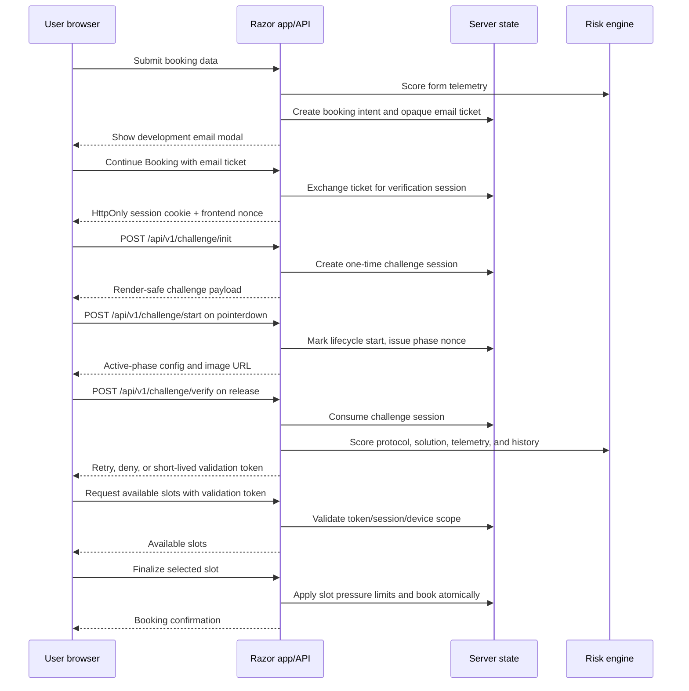
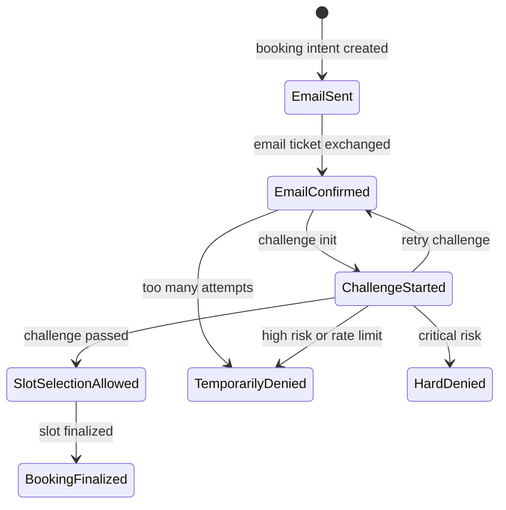

# Human-in-the-Loop Booking Protection Sample

This repository is a .NET 10 / Razor Pages sample that demonstrates a layered
anti-automation flow for scarce appointment slot booking.

The goal is not to "prove" that a user is human. A determined attacker with a
real browser, visual reasoning, and time can solve many interactive challenges.
The goal is to increase the cost and reduce the reliability of automated slot
booking by combining several weaker signals:

- email confirmation before any slot inventory is exposed;
- short-lived server-side booking state;
- a custom interactive slider challenge;
- server-side challenge lifecycle validation;
- pointer/touch telemetry and trajectory heuristics;
- risk scoring instead of one brittle hard rule;
- rate limits across email, IP, subnet, device, challenge attempts, validation
  tokens, and slot pressure;
- short-lived validation tokens before slot selection and finalization.

The implementation lives in `src/`. The design rationale is captured in
`DESIGN_DOC.MD`, and the current implementation status is summarized there in
section 22.

## Running The Sample

Requirements:

- .NET 10 SDK

Run:

```bash
dotnet run --project src
```

Then open the URL printed by ASP.NET, usually:

```text
http://localhost:5149
```

The app shows a booking-data form. Submitting the form opens a development
"email" modal instead of sending a real email. Pressing `Continue Booking` opens
the challenge page in a new tab. After a successful challenge, the slot calendar
is shown.

## High-Level Flow



## State Model

The sample keeps separate temporary objects for separate security purposes. This
is intentional: mixing them makes replay and invalid transitions easier.



Main state objects:

- `BookingIntent`: the user's booking request, email hash, current status,
  attempt counters, and accumulated risk context.
- `VerificationSession`: a short-lived browser session created after the email
  ticket is opened. Its id is cookie-only: JavaScript never receives it. Same
  site API calls are bound with the HttpOnly cookie plus the
  `X-Booking-Session-Nonce` header.
- `ChallengeSession`: a one-time slider challenge with server-owned target,
  tolerance, variant, phase nonce, follow-up nonce when needed, and timing.
- `ValidationGrant`: a short-lived token that unlocks slot selection and
  finalization after a successful challenge. It is bound to the verification
  session/device and to the first queried slot group.

## Security Design Principles

### Treat The Slider As Friction, Not Proof

The slider is not the security boundary by itself. It is a custom interaction
layer that creates work for automation and produces telemetry for the risk
engine. The final decision depends on the visual solution, protocol lifecycle,
trajectory shape, browser signals, retry history, and rate limits.

### Keep Answers Server-Side

The browser receives only render-safe data:

- image URLs;
- dimensions needed to render the UI;
- variant name;
- activation delay;
- hold requirement for hold-mode challenges.

The browser does not receive the real target X coordinate, tolerance, phase
nonce before `/start`, or server timestamps.

### Make One Screenshot Insufficient

The active target is revealed or changed only after `pointerdown` and a short
randomized delay. This breaks the cheapest automation pattern:

```text
load page -> take screenshot -> find target -> drag once -> verify
```

Instead, the client must go through this lifecycle:

```text
/init -> pointerdown -> /start -> active phase -> movement adjustment -> /verify
```

### Use Risk Signals, Not Single Fragile Rules

Every client-submitted signal can be forged. The risk engine therefore treats
signals as additive evidence. A normal user can recover from one bad drag, but
repeated failures, replayed trajectories, impossible timing, and protocol
violations compound into retry, cooldown, or denial.

### Separate Booking Access From Slot Access

The app never exposes slots directly after form submission. The user must first
obtain a short-lived validation token. That token is scoped to the booking
intent, email hash, verification session, and coarse device hash.

## Custom Interactive Challenge

The challenge currently has four variants:

| Variant | Purpose |
| --- | --- |
| `reveal_target` | The target is visually revealed only after the active phase starts. |
| `shift_after_start` | The preview target differs from the real target, forcing post-start correction. |
| `hold_and_release` | The user must align, pause briefly, then release after a server-chosen hold window. |
| `follow_up_shift` | After `/start`, the target changes again through `/challenge/follow-up`; the user must make a real post-follow-up correction. |

Challenge parameters are randomized per session:

- target X coordinate;
- preview target offset;
- piece Y coordinate;
- tolerance;
- track width;
- handle size;
- stripe/noise offset;
- active-phase delay;
- hold requirement.
- follow-up target, delay, nonce, and required post-follow-up adjustment for
  `follow_up_shift`.

The challenge also has a second movement plane: the handle can move slightly on
the Y axis. The horizontal position still solves the puzzle, but the Y-axis
motion gives the trajectory analyzer another signal. A perfectly horizontal
desktop trace is suspicious because it is cheap to synthesize.

Relevant files:

- `src/Security/Challenges/InteractiveChallengeSessionFactory.cs`
  creates server-owned challenge sessions and randomizes variants/parameters.
- `src/Security/Challenges/ChallengeModels.cs`
  defines challenge sessions, render payloads, solution metadata, and telemetry
  DTOs.
- `src/Security/Challenges/ChallengeProtocolValidator.cs`
  checks lifecycle correctness: `/start`, phase nonce, active phase, hold
  timing, and required active-phase adjustment.
- `src/Security/Challenges/ChallengeAssetRenderer.cs`
  renders the demo PNG/SVG challenge assets. This is intentionally replaceable.
- `src/wwwroot/js/challenge.js`
  implements the browser interaction, pointer/touch telemetry collection,
  challenge lifecycle calls, retry behavior, and slot display.

## Challenge Protocol

### 1. Initialize

```text
POST /api/v1/challenge/init
```

The server validates the verification session, rate limits challenge creation,
creates a one-time `ChallengeSession`, and returns render-safe payload only.
The request does not include `verification_session_id`; the server resolves the
session from the HttpOnly cookie and the `X-Booking-Session-Nonce` header.

Returned asset URLs contain short-lived asset tokens bound to the challenge id,
verification session id, phase, and current cookie session. A copied image URL
without the matching session cookie or after token expiry returns 404.

### 2. Start Interaction

```text
POST /api/v1/challenge/start
```

This call is made after `pointerdown`. The server marks the challenge as started,
generates a phase nonce, records activation timing, and returns the active image
URL.

Motivation: a script should not be able to generate an offline answer without
starting an interaction lifecycle.

### 3. Optional Follow-Up

```text
POST /api/v1/challenge/follow-up
```

Only `follow_up_shift` uses this call. It requires the current session cookie,
nonce header, challenge id, and phase nonce. The server creates a follow-up
nonce, schedules the final visual state, and returns a signed follow-up asset
URL.

Motivation: this forces automation to remain inside the active interaction loop
and react to a second server-marked visual change.

### 4. Verify

```text
POST /api/v1/challenge/verify
```

The challenge is consumed immediately. The server then evaluates:

- whether final X is within the server-owned tolerance;
- whether the lifecycle protocol was satisfied;
- whether the reported phase nonce matches;
- whether the follow-up nonce and post-follow-up movement exist for
  `follow_up_shift`;
- whether active time and hold timing are plausible;
- whether telemetry contains required active-phase adjustment;
- trajectory heuristics;
- browser signals;
- retry and failure history.

The result is one of:

- `allow`: issue a validation token;
- `retry_challenge`: let the user try a fresh challenge after cooldown;
- `temporarily_denied`: stop this flow for a while;
- `hard_denied`: deny the current ticket/session.

The applied decision is controlled by `BotDefense:EnforcementMode`:

| Mode | Behavior |
| --- | --- |
| `Shadow` | Always applies `allow`, while audit logs the real would-have decision. This is the default. |
| `RetryOnly` | Allows normal passes and applies retry, but suppresses temporary/hard denies. |
| `CooldownOnly` | Applies retry and temporary deny; converts hard deny to temporary deny. |
| `Full` | Applies the risk engine decision exactly. |

## Trajectory Heuristics

The telemetry analyzer is in:

```text
src/Security/Risk/TrajectoryAnalyzer.cs
```

It converts raw pointer/touch points into movement segments and scores features
such as:

- missing or sparse telemetry;
- missing drag start/release phases;
- missing active visual state;
- non-monotonic timestamps;
- compressed event timing;
- repeated event intervals;
- mismatch between final trace position and submitted solution;
- mismatch between trace duration and reported solve duration;
- no forward progress;
- flat Y axis on desktop;
- nearly perfect line;
- missing second-plane variation;
- repeated step sizes;
- constant speed profile;
- weak acceleration/deceleration profile;
- large coordinate jumps;
- impossible pointer speed;
- repeated coarse trajectory fingerprint within the same ticket.

Touch input is scored more gently than desktop mouse input. Mobile browsers
produce fewer and burstier events, so the analyzer avoids strict touch-only
requirements such as `force`, `radiusX`, or high Y variance.

The analyzer intentionally returns risk signals, not a final decision. The
broader risk engine decides what to do with those signals.

## Risk Engine

The risk engine is in:

```text
src/Security/Risk/RiskEngine.cs
```

It combines:

- form telemetry risk;
- browser automation hints such as `navigator.webdriver` and headless user
  agents;
- challenge visual/protocol success;
- solve timing;
- focus and visibility lifecycle;
- pointer/touch modality consistency;
- trajectory risk;
- repeated trajectory fingerprint;
- challenge retry and failure history.

The sample thresholds are intentionally simple:

```text
low risk       -> allow
medium risk    -> retry challenge
high risk      -> temporary deny
critical risk  -> hard deny
```

These values are sample defaults. In a real deployment they should be calibrated
in shadow mode using real production traffic.

## Rate Limits And Abuse Controls

`BookingFlowStore` applies multiple independent limits:

- email sends per email hash;
- email sends per IP;
- email sends per subnet;
- email sends per email domain;
- challenge inits per ticket;
- failed challenges per ticket;
- challenge inits per IP and device;
- challenge verifies per IP;
- validation tokens per email, IP, and device;
- slot finalizations per slot group;
- slot finalizations per individual slot.
- slot-group pressure snapshots that shorten validation-token TTLs, reduce slot
  list access, and bind validation tokens to the first queried slot group.

The motivation is to reduce scale. A single CAPTCHA bypass should not grant the
ability to mass-reserve or repeatedly attack scarce slots.

Current implementation:

- `src/Services/ITemporarySecurityStateStore.cs` defines Redis-shaped atomic
  semantics: `SetIfNotExists`, `CompareAndSet`, `TryConsumeOnce`, and
  `IncrementWithExpiry`.
- `src/Services/InMemoryTemporarySecurityStateStore.cs` is a demo
  implementation. Its comments mark where Redis must provide Lua/transactional
  equivalents before multi-replica deployment.

## Interesting Files

### Application Entry Point

- `src/Program.cs`
  registers services, configures JSON naming, adds origin checks, maps Razor
  Pages, and defines the sample API endpoints.

### Booking Flow

- `src/Services/BookingFlowStore.cs`
  coordinates the booking state machine. It owns booking-specific concerns:
  email tickets, verification sessions, validation grants, rate limits, audit
  events, and slot finalization.

- `src/Services/BookingDomain.cs`
  contains booking domain models, request/response DTOs, and audit event types.

- `src/Services/SecurityHelpers.cs`
  contains token generation and coarse hashing helpers.

### Reusable Security Subsystem

- `src/Security/Challenges/ChallengeContracts.cs`
  exposes challenge interfaces for session creation, rendering, and protocol
  validation.

- `src/Security/Risk/RiskContracts.cs`
  exposes risk and trajectory interfaces.

- `src/Security/README.md`
  gives a compact overview of the reusable security subsystem.

### Frontend

- `src/Pages/Index.cshtml`
  initial booking form and development email modal.

- `src/Pages/ConfirmBooking.cshtml`
  challenge and slot-selection page.

- `src/wwwroot/js/booking-form.js`
  form telemetry, booking intent creation, and email preview modal behavior.

- `src/wwwroot/js/challenge.js`
  slider lifecycle, telemetry collection, challenge verification, retry logic,
  slot rendering, and booking finalization.

- `src/wwwroot/css/site.css`
  visual styling for the booking form, challenge, and slots view.

## Using The Security Layer In Your Own Project

The reusable parts are deliberately isolated under `src/Security`.

Recommended integration approach:

1. Copy or package `src/Security/Challenges` and `src/Security/Risk`.
2. Register the contracts in your DI container:

```csharp
services.AddSingleton<ITrajectoryAnalyzer, TrajectoryAnalyzer>();
services.AddSingleton<IChallengeProtocolValidator, ChallengeProtocolValidator>();
services.AddSingleton<IRiskEngine, RiskEngine>();
services.AddSingleton<IChallengeSessionFactory, InteractiveChallengeSessionFactory>();
services.AddSingleton<IChallengeAssetRenderer, ChallengeAssetRenderer>();
```

3. Implement production state storage behind a Redis-backed service equivalent
   to `ITemporarySecurityStateStore`.
4. Build your own application-specific flow around the security layer:
   create intent, confirm email, initialize challenge, start interaction, verify
   challenge, issue short-lived grant, then unlock the protected action.
5. Replace `ChallengeAssetRenderer` if you want to use a vetted third-party
   image/puzzle renderer or an external challenge service.
6. Keep `IRiskEngine` and `ITrajectoryAnalyzer` behind interfaces so you can
   tune, shadow, A/B test, or replace heuristics without changing the booking
   state machine.

The sample's `BookingFlowStore` is useful as a reference implementation, but in
a production system it should usually be split into:

- a database-backed booking intent service;
- a Redis-backed temporary-state service;
- a risk decision service;
- an audit/logging pipeline;
- a slot inventory service with proper locking or database transactions.

## Why Not Just Use A CAPTCHA Provider?

A commercial CAPTCHA provider can be a good production layer. This sample shows
why a custom layer can still be valuable:

- it creates non-commodity friction that generic solvers may not support;
- it gives full control over telemetry and risk signals;
- it can be adapted to the booking domain and slot pressure;
- it can be combined with email tickets, validation grants, and inventory
  throttling.

The right production answer may be hybrid:

```text
custom interactive challenge
+ server-side state machine
+ Redis rate limits
+ production risk logging
+ optional external CAPTCHA or device reputation provider
+ slot pressure controls
```

## Current Limitations

This is a sample, not a drop-in production security product.

Known limitations:

- state is process-local in memory;
- audit endpoint is open for development visibility;
- no production database;
- no automated test project yet;
- risk enforcement is active without shadow-mode calibration;
- no ASN/IP reputation integration;
- no production metrics dashboard;
- mobile/touch thresholds need real-device calibration;
- slot inventory is static demo data;
- email is shown in a modal instead of actually sent;
- accessibility is not production-ready.

## Production Hardening Backlog

These are the main upgrades required before using this approach in a real
booking system.

### 1. Replace In-Memory State With Redis

Use Redis for email tickets, verification sessions, challenge sessions,
validation grants, counters, cooldowns, and replay fingerprints.

Why: the current in-memory store only works inside one process. Production needs
shared state across app instances, TTLs that survive restarts, and atomic
operations such as consume-once, increment-with-expiry, and compare-and-set for
challenge start.

### 2. Add Production Persistence

Store booking intents, finalized bookings, audit records, and slot inventory in
a real database.

Why: booking state must survive restarts and support operational investigation.
Slot finalization must use database transactions or locks, not process-local
mutation.

### 3. Introduce Shadow Mode

Run risk scoring without enforcement first:

```text
calculate risk -> log would-have-retried/denied -> allow user through
```

Why: risk thresholds cannot be guessed safely. Shadow mode lets you measure
false positives, mobile pass rates, browser-specific problems, and real attack
patterns before blocking users.

### 4. Add Kill Switches And Staged Rollout

Make challenge enforcement, risk thresholds, and deny decisions configurable at
runtime.

Why: if a browser update, mobile bug, or renderer regression causes failures,
operators need to reduce friction immediately without redeploying code.

### 5. Protect Audit And Admin Endpoints

Require admin authentication and authorization for audit endpoints.

Why: audit data contains sensitive operational signals. Even with hashed
identifiers, it can reveal risk logic, traffic patterns, and debugging details.

### 6. Add ASN, IP Reputation, And Device Intelligence

Enrich risk context with ASN, hosting/VPN/proxy signals, known bad IP ranges,
and coarse device reputation.

Why: interaction telemetry catches per-session behavior. Reputation and network
signals catch scale patterns across many emails and sessions.

### 7. Build Metrics And Dashboards

Track challenge pass rate, fail rate, retry rate, solve time, mobile vs desktop
performance, browser breakdown, validation-token issuance, slot finalization,
and high-risk traffic volume.

Why: this system depends on calibration. Without metrics, you cannot know
whether it is stopping bots, hurting real users, or simply adding friction.

### 8. Expand Automated Tests

The repository now contains unit and integration tests for protocol bypasses,
session binding, signed assets, enforcement modes, token consumption, rate
limits, slot pressure, and concurrency. Keep expanding them with:

- challenge protocol validation;
- trajectory heuristics;
- risk decision thresholds;
- one-time challenge consumption;
- validation-token scoping;
- rate limit counters;
- slot finalization.

Add browser tests for desktop and mobile flows, plus a Redis-backed integration
suite once the Redis adapter exists.

Why: small changes to heuristics can accidentally block real users or reopen an
automation path. Tests give confidence while the challenge evolves.

### 9. Calibrate Mobile Separately

Collect real iOS and Android telemetry and tune separate thresholds for touch
input.

Why: mobile browsers produce different pointer event density, timing, and Y-axis
behavior. Desktop heuristics can create false positives on touch devices.

### 10. Improve Slot Inventory Protection

Add progressive inventory release, slot holds, per-slot cooldowns, and delayed
exposure for high-pressure slot groups.

Why: CAPTCHA and risk checks reduce automated entry, but slot attacks often
happen after verification. Inventory controls reduce the value of a successful
challenge bypass.

### 11. Make Rate-Limit Responses Non-Enumerating

Return generic responses for email creation and other sensitive limits.

Why: detailed errors such as `email_rate_limited` are useful in a demo, but in
production they can help attackers enumerate valid addresses or tune request
rates.

### 12. Add Accessibility And Fallback Paths

Provide an accessible alternative challenge or assisted verification path.

Why: pointer-based puzzles can exclude users with motor, visual, or device
constraints. A production system needs a way to handle legitimate users who
cannot complete the slider reliably.

### 13. Keep Rotating Challenge Variants

Continue adding and tuning challenge variants over time.

Why: a static custom challenge eventually becomes a target. The defensive value
comes from making adaptation expensive and keeping automation brittle.

## Bottom Line

This sample demonstrates a practical defense-in-depth pattern for appointment
booking:

```text
email intent
+ server-side temporary state
+ custom dynamic challenge
+ telemetry heuristics
+ risk scoring
+ short-lived validation token
+ slot pressure controls
```

It should catch naive automation and materially raise the cost for more capable
browser agents. It should not be treated as a complete production anti-bot
system until the hardening backlog above is implemented and calibrated with real
traffic.
